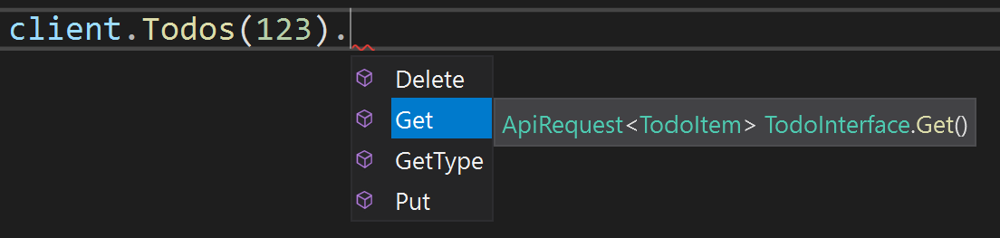
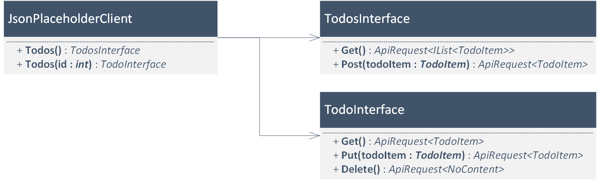
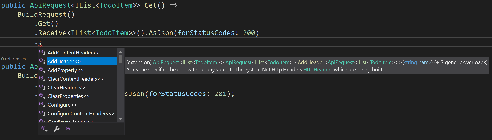

# Getting Started

## Introduction

This guide is going to teach you how to work with the ReqRest library by showing you, step-by-step,
how an API client can be written with ReqRest.
The client is going to interact with the [JSON Placeholder API](https://jsonplaceholder.typicode.com)
created by [typicode](https://github.com/typicode). JSON Placeholder is an awesome fake REST API
which mocks responses and is thus ideal for demo projects. If you want to learn more about it,
have a look at the documentation [here](https://jsonplaceholder.typicode.com/guide.html).

Towards the end of this article, the API client will be able to interact with the `/todos` and 
`/todos/{id}` endpoints. These endpoints deal with the `TodoItem` resource which looks like this:

```json
{
    "userId": 1,
    "id": 1,
    "title": "Learn about ReqRest",
    "completed": false
}
```

By using the final client, a user will be able to interact with the API using code similar to this:

```csharp
var client = new JsonPlaceholderClient();

// For the /todos endpoint:
client.Todos().Get();
client.Todos().Post(new TodoItem() { Title = "Post something" });

// For the /todos/{id} endpoint:
client.Todos(1).Get();
client.Todos(2).Put(new TodoItem() { Title = "Update something" });
client.Todos(3).Delete();

// Note:
// The lines above compile, but are more or less useless, because the created requests aren't being sent.
// This is just for demonstration of what the client is capable of.
```

Furthermore, REST clients written with ReqRest are fully typed which means that you will get full
IntelliSense and compiler support:




## Installation and Project Setup 

Create a new console project and reference both the [`ReqRest`](https://www.nuget.org/packages/ReqRest)
and the [`ReqRest.Serializers.NewtonsoftJson`](https://www.nuget.org/packages/ReqRest.Serializers.NewtonsoftJson)
package, for example via:

```bash
dotnet new console -n GettingStarted
dotnet add package ReqRest
dotnet add package ReqRest.Serializers.NewtonsoftJson
```

Afterwards, create the `TodoItem` DTO class which is going to be used in the following code.

```csharp
using Newtonsoft.Json;

public class TodoItem
{
    [JsonProperty("id")]
    public int? Id { get; set; }

    [JsonProperty("userId")]
    public int? UserId { get; set; }

    [JsonProperty("title")]
    public string? Title { get; set; }

    [JsonProperty("completed")]
    public bool? Completed { get; set; }
}
```


## Creating the `JsonPlaceholderClient`

Independent of what API you are wrapping, you will always have to create a class which inherits
from @"ReqRest.RestClient". 
A `RestClient` class is the main entry point for users which want to interact with the REST API.
With such a client, users can start building requests against the API via method chains, for example
`myClient.Users(123).Todos().Post(newTodoItem)`.
Futhermore, a `RestClient` holds the configuration for the requests which are being made, for example
the API's base URL (in our case `https://jsonplaceholder.typicode.com`) or the @"System.Net.Http.HttpClient"
which should be used for making the requests.

For this example, create a new class called `JsonPlaceholderClient`, inherit from @"ReqRest.RestClient"
and copy the code below.

```csharp
using System;
using ReqRest;

public sealed class JsonPlaceholderClient : RestClient
{
    private static readonly RestClientConfiguration DefaultConfig = new RestClientConfiguration()
    {
        BaseUrl = new Uri("https://jsonplaceholder.typicode.com"),
    };

    public JsonPlaceholderClient(RestClientConfiguration? configuration = null)
        : base(configuration ?? DefaultConfig) { }
}
```

As you can see, any @"ReqRest.RestClient" must be configured with a @"ReqRest.RestClientConfiguration".
This configuration holds several important values with the most important one being the
@"ReqRest.RestClientConfiguration.BaseUrl". This base URL is used by ReqRest to build the final URL
of a request. For example, the code `client.Todos()` combines the base URL above with `"/todos"`,
resulting in the final URL `https://jsonplaceholder.typicode.com/todos` for the request.

> [!TIP]
> It is recommended to follow the example above and make the @"ReqRest.RestClientConfiguration"
> an optional constructor parameter so that a user **can** pass in a custom configuration, but
> **doesn't have** to.

Right now, the client can already be instantiated, but it cannot really do anything else.
As a next step, it will be extended with support for the `/todos` interface, so that code like 
`client.Todos().[...]` becomes possible.


## How ReqRest deals with API endpoints

Before any functionality is added to the `JsonPlaceholderClient`, it makes sense to talk about
what the REST API actually looks like and how ReqRest can be used to project it into C#.

The JsonPlaceholder API has the following endpoints and behavior:

| Endpoint      | HTTP Method | Status Code and JSON Result                                      |
|-------------- | ----------- | ---------------------------------------------------------------- |
| `/todos`      | `GET`       | `200`: `TodoItem[]`                                              |
|               | `POST`      | `201`: `TodoItem`                                                |
| `/todos/{id}` | `GET`       | `200`: `TodoItem`                                                |
|               | `PUT`       | `200`: `TodoItem`                                                |
|               | `DELETE`    | `200`: `{ }` _(treated as No Content for demonstration purposes)_|

You can see that the `/todos` and `/todos/{id}` endpoints basically form two separate groups with
different URLs and requests, even though they share the same name (`todos`).

ReqRest uses this fact and allows modeling these two groups via two different classes.
To be more concrete, the endpoints from above can be modeled and integrated into the `JsonPlaceholderClient`
like this:



As you can see in the image, the table from above can easily be translated into two classes
which provide methods for creating the requests that can be made against the specific endpoint.
Additionally, the `JsonPlaceholderClient` is extended with two methods that both return an instance of
each `...Interface` class. This instance can then be used to create the appropriate requests.

With the constellation above, it is possible to write code like `client.Todos().Get()` or
`client.Todos(123).Delete()`.
ReqRest then takes over and translates these method calls into valid HTTP requests (with your help).
In the following sections, you can see how these `...Interface` classes are written.


## Creating the `TodosInterface`

Whenever you want to wrap an endpoint with ReqRest, you will have to create a class which inherits
from @"ReqRest.RestInterface".
A @"ReqRest.RestInterface" has two purposes:

* It builds the URL of the API interface against which requests are made.
* It defines methods for creating the possible requests against that API interface.

Every class which inherits from @"ReqRest.RestInterface" will contain code similar to this:

```csharp
using ReqRest;
using ReqRest.Builders;

public sealed class TodosInterface : RestInterface
{
    internal TodosInterface(RestClient restClient)
        : base(restClient) { }

    protected override UrlBuilder BuildUrl(UrlBuilder baseUrl) =>
        baseUrl / "todos";
}
```

Two important things are happening here:

First of all, the @"ReqRest.RestInterface" expects a @"ReqRest.RestClient" instance in the constructor.
ReqRest uses this client to read out the configured @"ReqRest.RestClientConfiguration.BaseUrl".

In addition, every class inheriting from @"ReqRest.RestInterface" must override the 
@"ReqRest.RestInterface.BuildUrl(ReqRest.Builders.UrlBuilder)" method.
Every request which is created using this interface class will be made against the URL which is built
in this method. <br/>
As you can see in the code above, the method receives a single parameter, the `baseUrl`.
In this example, the `baseUrl` comes straight from the `JsonPlaceholderClient` and is thus
`https://jsonplaceholder.typicode.com`. The `TodosInterface` then appends the `"todos"` string which
leads to the final URL `https://jsonplaceholder.typicode.com/todos`.

> [!NOTE]
> The slash in `baseUrl / "todos"` is syntactic sugar replacing the @"ReqRest.Builders.UriBuilderExtensions.AppendPath*"
> method and simply adds the `"todos"` string to the URL's path while taking care of correctly formatting
> the slashes. This works similar to .NET's [Path.Combine(string, string)](xref:System.IO.Path.Combine(System.String,System.String))
> method.

Now that the class has been created, it can be extended with the `Get()` and `Post(TodoItem todoItem)`
methods which actually create requests that the user can make:

```csharp
using System.Collections.Generic;
using ReqRest;
using ReqRest.Builders;
using ReqRest.Serializers.NewtonsoftJson;

public sealed class TodosInterface : RestInterface
{
    // [...]

    public ApiRequest<IList<TodoItem>> Get() =>
        BuildRequest()
            .Get()
            .Receive<IList<TodoItem>>().AsJson(forStatusCodes: 200);
    
    public ApiRequest<TodoItem> Post(TodoItem? todoItem) =>
        BuildRequest()
            .PostJson(todoItem)
            .Receive<TodoItem>().AsJson(forStatusCodes: 201);
}
```

This is - hopefully - the part where ReqRest really starts to shine, because ideally, the code is
self explanatory.

Nontheless, the steps above are explained here:

* **`ApiRequest<IList<TodoItem>>` and `ApiRequest<TodoItem>`:** <br/>
  The @"ReqRest.ApiRequest`1" class is nothing else but a decorator around .NET's @"System.Net.Http.HttpRequestMessage"
  class. An important detail is the type parameter. It allows you to declare exactly which .NET type may
  be returned by the REST API if this request gets sent. This adds type safety later on, when the
  user interacts with the API's response.
* **`BuildRequest()`:** <br/>
  The [RestInterface.BuildRequest()](xref:ReqRest.RestInterface.BuildRequest) returns a new
  @"ReqRest.RestInterface" instance and sets the [RequestUri](xref:ReqRest.Builders.HttpRequestMessageBuilder.RequestUri)
  which gets returned by the @"ReqRest.RestInterface.BuildUrl(ReqRest.Builders.UrlBuilder)" method above. <br/>
* **`Get()`:** <br/>
  [Get()](xref:ReqRest.Builders.HttpMethodBuilderExtensions.Get``1(``0)) changes the request's HTTP method to `GET`.
* **`Receive<IList<TodoItem>>().AsJson(forStatusCodes: 200)`:** <br/>
  @"ReqRest.ApiRequest.Receive``1" _upgrades_ the @"ReqRest.ApiRequest" into an @"ReqRest.ApiRequest`1",
  i.e. it adds compile-time information that a response to this HTTP request may have a body which can
  be deserialized into an `IList<TodoItem>`. <br/>
  [AsJson(params StatusCodeRange[] forStatusCodes)](xref:ReqRest.Serializers.NewtonsoftJson.JsonResponseTypeInfoBuilderExtensions.AsJson``1(ReqRest.ResponseTypeInfoBuilder{``0},ReqRest.Http.StatusCodeRange[]))
  declares that this `IList<TodoItem>` can only be received if the status code is `200` and that the
  body should be deserialized from JSON.
* **`PostJson(todoItem)`:** <br/>
  [PostJson(object? content)](xref:ReqRest.Serializers.NewtonsoftJson.JsonHttpMethodBuilderExtensions.PostJson``1(``0,System.Nullable{System.Object},System.Nullable{System.Text.Encoding},System.Nullable{ReqRest.Serializers.NewtonsoftJson.JsonHttpContentSerializer}))
  changes the HTTP method to `POST` and sets the request's HTTP content to the JSON representation of
  the specified `todoItem`.

There are a lot of additional methods which can help you to build the exact HTTP request that you
want. In fact, you can change every single property that .NET's @"System.Net.Http.HttpRequestMessage"
provides - and many more. <br/>
Feel free to explore the available methods using IntelliSense:



Now that the methods have been added, the only thing left to do is to integrate the `TodosInterface`
into the `JsonPlaceholderClient`:

```csharp
using System;
using ReqRest;

public sealed class JsonPlaceholderClient : RestClient
{
    // [...]

    public TodosInterface Todos() =>
        new TodosInterface(this);
}
```

At this point, the `TodosInterface` is entirely done. You can try it out with the code below!
In this example, you can already see the advantage of declaring what the API returns for which
status code - ReqRest does the entire deserialization and status code matching for you.

Don't worry too much if you don't understand this example in its entirety. There is an entire
other guide which explains how you can actually **use** a client written with ReqRest.

```csharp
public static async Task Main(string[] args)
{
    var client = new JsonPlaceholderClient();
    var response = await client.Todos().Get().FetchResponseAsync();
    var resource = await response.DeserializeResourceAsync();

    // The API may not always return the status code 200.
    // ReqRest automatically does the checking for you and calls the correct method depending on the actual status code.
    resource.Match(
        todoItems => Console.WriteLine($"Received status code 200. There are {todoItems.Count} items!"),
        ()        => Console.WriteLine($"Received an unexpected status code: {response.StatusCode}.")
    );
}
```


## Creating the `TodoInterface`

The next interface to be created is the `/todos/{id}` interface for interacting with a single
`TodoItem`.

This works similarly to the creation of the `TodosInterface`, but has a few twists:

```csharp
using ReqRest;
using ReqRest.Builders;
using ReqRest.Serializers.NewtonsoftJson;
using ReqRest.Http;

public sealed class TodoInterface : RestInterface
{
    private int _id;

    internal TodoInterface(int id, RestClient restClient) 
        : base(restClient)
    {
        _id = id;
    }

    protected override UrlBuilder BuildUrl(UrlBuilder baseUrl) =>
        baseUrl / "todos" / $"{_id}";

    public ApiRequest<TodoItem> Get() =>
        BuildRequest()
            .Get()
            .Receive<TodoItem>().AsJson(200);

    public ApiRequest<TodoItem> Put(TodoItem? todoItem) =>
        BuildRequest()
            .PutJson(todoItem)
            .Receive<TodoItem>().AsJson(200);

    // This is a little bit special.
    // The JSON Placeholder API returns an empty object {} when a DELETE request succeeds. 
    //
    // For demonstration purposes, this code interprets this as 'NoContent'.
    // Normally, NoContent should be used when a request returns an empty HTTP content
    // (which is also typical for a DELETE request).
    public ApiRequest<NoContent> Delete() =>
        BuildRequest()
            .Delete()
            .ReceiveNoContent(200);
}
```

There are two specialties in this code - the first one is how the ID gets transported into the
class. This is ideally done via the constructor (you will soon see why) and then storing it as a
field, until it is needed by `BuildUrl`.

Furthermore, the `Delete()` method uses the [ReceiveNoContent](xref:ReqRest.ApiRequest.ReceiveNoContent(ReqRest.Http.StatusCodeRange[]))
method to declare that it receives the special @"ReqRest.Http.NoContent" type. As you can see, there
is no additional method call like `AsJson(...)` here, because it is not necessary to declare
which data format "No Content" has.

> [!NOTE]
> There are also other methods similar to [ReceiveNoContent](xref:ReqRest.ApiRequest.ReceiveNoContent(ReqRest.Http.StatusCodeRange[]))
> available, for example [ReceiveString](xref:ReqRest.ApiRequest.ReceiveString(ReqRest.Http.StatusCodeRange[]))
> or [ReceiveByteArray](xref:ReqRest.ApiRequest.ReceiveByteArray(ReqRest.Http.StatusCodeRange[])).

After creating the `TodoInterface` class, don't forget to add it to the `JsonPlaceholderClient`:

```csharp
using System;
using ReqRest;

public sealed class JsonPlaceholderClient : RestClient
{
    // [...]

    public TodoInterface Todos(int id) =>
        new TodoInterface(id, this);
}
```

Here you can see why the ID should ideally be passed via the constructor - because it allows the
client to just pass it forward when creating the interface instance.

When you have two interfaces which interact with the same resource (and a similar endpoint) like in
this example, it is a good idea to give the two methods the same name by overloading them.
This allows expressive code like this:

```csharp
client.Todos().[...]    // for accessing /todos
client.Todos(123).[...] // for accessing /todos/123
```

As you can see, the methods exposed by the client can be directly mapped to the endpoint, just in a
"more C#-ish" way.


## Using the Client

First of all, congratulations! You have finished your first, fully functional REST API client with
ReqRest! Even though it is not complete yet, you can already use it to interact with the APIs
`TodoItem` resource.

Feel free to go ahead and try it out by making some requests and see how it works.

To show a concrete (and more complex) example of how it can be used, the following code section
displays a way to delete all items with an ID smaller than 10.
This example shows how you can use both ReqRest's response type matching and the plain, old
status code checking. 

```csharp
public static async Task Main(string[] args)
{
    var client = new JsonPlaceholderClient();
    var items = await FetchItemsToUpdate(client);

    foreach (var item in items)
    {
        await DeleteItem(client, item);
    }
}

static async Task<IEnumerable<TodoItem>> FetchItemsToUpdate(JsonPlaceholderClient client)
{
    var resource = await client.Todos().Get().FetchResourceAsync();

    // Let ReqRest do the work of checking what gets returned for which status code.
    // Note that Match(...) supports returning values inside of the functions.
    // The result of the function which ultimately gets called also gets returned by Match(...).
    return resource.Match(
        items => items.Where(item => item.Id < 10),
        ()    => throw new Exception("Failed to fetch any TODOs.")
    );
}

static async Task DeleteItem(JsonPlaceholderClient client, TodoItem item)
{
    var id = item.Id.GetValueOrDefault();
    var response = await client.Todos(id).Delete().FetchResponseAsync();
    
    // The response is nothing else but a wrapper around the System.Net.Http.HttpResponseMessage.
    // As such, we have access to the underlying properties, e.g. the StatusCode.
    if (response.StatusCode != HttpStatusCode.OK)
    {
        throw new Exception($"Failed to delete the item with the ID {id}.");
    }

    // Note:
    // Alternatively to checking the response's status code, you could also
    // use FetchResource like in the method above.
    // This leads to a more functional style and lets ReqRest do the status
    // code checking for you, but it is certainly the more "unusual" style
    // and may be harder to understand in the beginning.
    // The code would look like this:

    var result = await client.Todos(id).Delete().FetchResourceAsync();
    result.Match(
        noContent => { /* All good, deleting worked. */ }, 
        ()        => throw new Exception($"Failed to delete the item with the ID {id}.")
    );

    // Or with an alternative to Match:
    if (!result.TryGetValue(out NoContent _))
    {
        throw new Exception($"Failed to delete the item with the ID {id}.");
    }

    // All in all, ReqRest gives you a lot of options to get your task done.
    // It is up to you to choose which flavor you prefer for which scenario.
}
```


## Next Steps

If you got this far, you should have an overview of what ReqRest is capable of.
If you are still interested in learning more, feel free to check out the guides [here](xref:guides)
or browse the [API documentation](xref:api).
